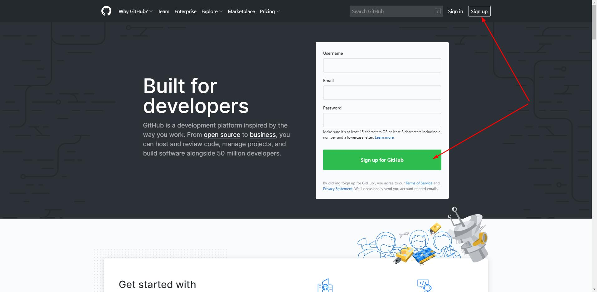
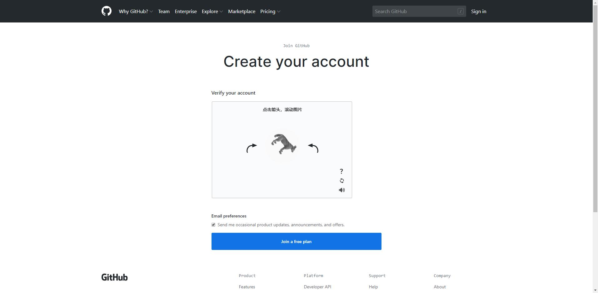
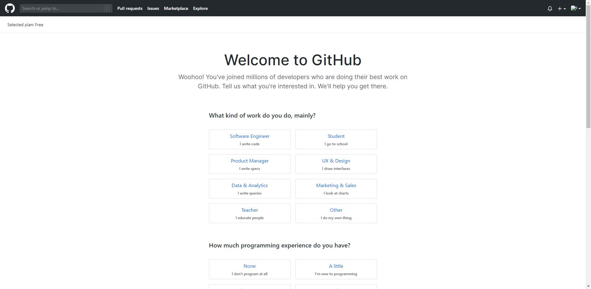
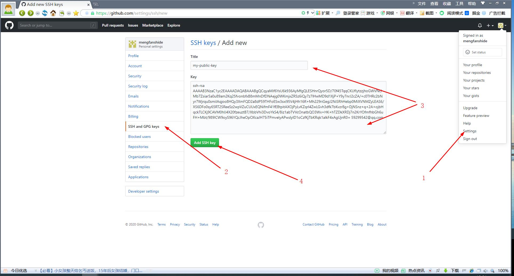
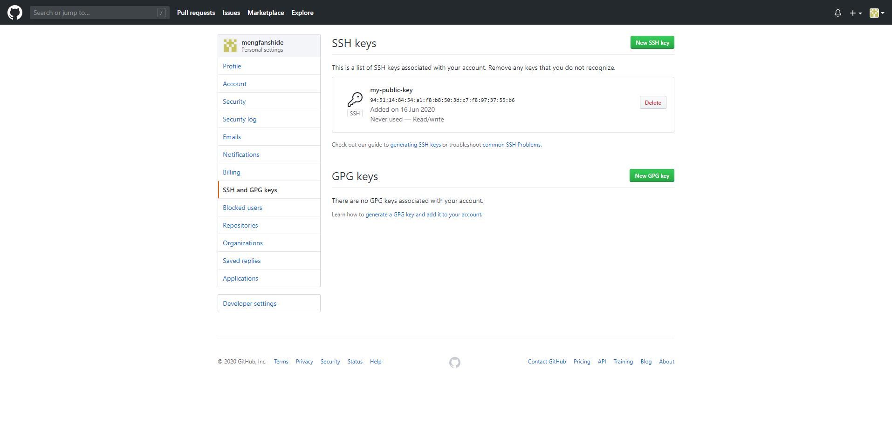

# GIT

## GIT远程仓库

Git是分布式版本控制系统，同一个Git仓库，可以分布到不同的机器上。最早，肯定只有一台机器有一个原始版本库，此后，别的机器可以“克隆”这个原始版本库，而且每台机器的版本库其实都是一样的，并没有主次之分。

在一台电脑上也可以克隆多个版本库的，只要不在同一个目录下。不过，现实生活中是不会有人做的的，因为一台电脑上搞几个远程库完全没有意义，而且硬盘挂了会导致所有库都挂掉。

实际情况往往是这样，找一台电脑充当服务器的角色，每天24小时开机，其他每个人都从这个“服务器”仓库克隆一份到自己的电脑上，并且各自把各自的提交推送到服务器仓库里，也从服务器仓库中拉取别人的提交。

完全可以自己搭建一台运行Git的服务器，但是没有必要。有个叫[GitHub](https://github.com/)的网站，从名字就可以看出，这个网站就是提供Git仓库托管服务的，所以，只要注册一个GitHub账号，就可以免费获得Git远程仓库。

先注册GitHub账号:

一、直接输入注册或者点击Sign up进入注册页面



二、把图摆正, 证明我们是人...



三、选择一些偏好的内容, 推送用



四、去邮箱验证邮件, 点击按钮就行


由于我们的本地Git仓库和GitHub仓库之间的传输是通过SSH加密的，所以，需要一点设置：

第1步：创建SSH Key。在用户主目录下，看看有没有.ssh目录，如果有，再看看这个目录下有没有`id_rsa`和`id_rsa.pub`这两个文件，如果已经有了，可直接跳到下一步。如果没有，打开Shell（Windows下打开Git Bash），创建SSH Key：

```bash
$ ssh-keygen -t rsa -C "youremail@example.com"
```

我们需要把邮件地址换成我们自己的邮件地址，然后一路回车，使用默认值即可，由于这个Key也不是用于军事目的，所以也无需设置密码。

如果一切顺利的话，可以在用户主目录里找到`.ssh`目录，里面有`id_rsa`和`id_rsa.pub`两个文件，这两个就是SSH Key的秘钥对，`id_rsa`是私钥，不能泄露出去，`id_rsa.pub`是公钥，可以放心地告诉任何人。

第2步：登陆GitHub，打开"settings”，“SSH Keys”页面：

然后，点“Add SSH Key”，填上任意Title，在Key文本框里粘贴`id_rsa.pub`文件(可以直接用IDE打开)的内容：



点“Add Key”，我们可以看到已经添加的Key：



GitHub需要识别出我们推送的提交确实是我们推送的，而不是别人冒充的，而Git支持SSH协议，所以，GitHub只要知道了我们的公钥，就可以确认只有我们自己才能推送。

当然，GitHub允许我们添加多个Key。假定我们有若干电脑，我们一会儿在公司提交，一会儿在家里提交，只要把每台电脑的Key都添加到GitHub，就可以在每台电脑上往GitHub推送了。

在GitHub上免费托管的Git仓库，任何人都可以看到（但只有我们自己才能改）。所以，不要把敏感信息放进去。

如果我们不想让别人看到Git库，有两个办法，一个是交点保护费，让GitHub把公开的仓库变成私有的，这样别人就看不见了（不可读更不可写）。另一个办法是自己动手，搭一个Git服务器，因为是我们自己的Git服务器，所以别人也是看不见的。这个方法我们后面会讲到的，相当简单，公司内部开发必备。