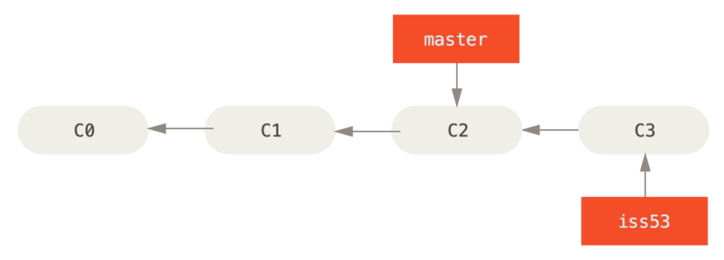

# GIT

## GIT分支冲突

让我们来看一个简单的分支新建与分支合并的例子，实际工作中你可能会用到类似的工作流。 你将经历如下步骤：

1. 开发某个网站。
2. 为实现某个新的用户需求，创建一个分支。
3. 在这个分支上开展工作。

正在此时，你突然接到一个电话说有个很严重的问题需要紧急修补。 你将按照如下方式来处理：

1. 切换到你的线上分支（production branch）。
2. 为这个紧急任务新建一个分支，并在其中修复它。
3. 在测试通过之后，切换回线上分支，然后合并这个修补分支，最后将改动推送到线上分支。
4. 切换回你最初工作的分支上，继续工作。

### 新建分支

首先，我们假设你正在你的项目上工作，并且在 `master` 分支上已经有了一些提交。


创建一个新分支指针

你继续在 #53 问题上工作，并且做了一些提交。 在此过程中，`iss53` 分支在不断的向前推进，因为你已经检出到该分支 （也就是说，你的 `HEAD` 指针指向了 `iss53` 分支）

```bash
$ git checkout -b iss53
$ git commit -a -m 'added a new footer [issue 53]'
```



现在你接到那个电话，有个紧急问题等待你来解决。 有了 Git 的帮助，你不必把这个紧急问题和 `iss53` 的修改混在一起， 你也不需要花大力气来还原关于 53# 问题的修改，然后再添加关于这个紧急问题的修改，最后将这个修改提交到线上分支。 你所要做的仅仅是切换回 `master` 分支。

但是，在你这么做之前，要留意你的工作目录和暂存区里那些还没有被提交的修改， 它可能会和你即将检出的分支产生冲突从而阻止 Git 切换到该分支。 之后我们会处理这个问题，现在，我们假设你已经把你的修改全部提交了，这时你可以切换回 `master` 分支了：

```bash
$ git switch master
Switched to branch 'master'
```

这个时候，你的工作目录和你在开始 #53 问题之前一模一样，现在你可以专心修复紧急问题了。 请牢记：当你切换分支的时候，Git 会重置你的工作目录，使其看起来像回到了你在那个分支上最后一次提交的样子。 Git 会自动添加、删除、修改文件以确保此时你的工作目录和这个分支最后一次提交时的样子一模一样。

接下来，你要修复这个紧急问题。 我们来建立一个 `hotfix` 分支，在该分支上工作直到问题解决：

```bash
$ git switch -c hotfix
Switched to a new branch 'hotfix'
$ git commit -a -m 'fixed the broken email address'
[hotfix 073415a] commit on hotfix
 1 file changed, 2 insertions(+), 1 deletion(-)
```


将 `hotfix` 分支合并回你的 `master` 分支来部署到线上。 你可以使用 `git merge` 命令来达到上述目的：

```bash
$ git switch master
$ git merge hotfix
Updating 7675dfc..073415a
Fast-forward
 index.txt | 3 ++-
 1 file changed, 2 insertions(+), 1 deletion(-)
```

在合并的时候，你应该注意到了“快进（fast-forward）”这个词。 由于你想要合并的分支 `hotfix` 所指向的提交 `C4` 是你所在的提交 `C2` 的直接后继， 因此 Git 会直接将指针向前移动。换句话说，当你试图合并两个分支时， 如果顺着一个分支走下去能够到达另一个分支，那么 Git 在合并两者的时候， 只会简单的将指针向前推进（指针右移），因为这种情况下的合并操作没有需要解决的分歧——这就叫做 “快进（fast-forward）”。

现在，最新的修改已经在 `master` 分支所指向的提交快照中，你可以着手发布该修复了。


 `master` 被快进到 `hotfix`

关于这个紧急问题的解决方案发布之后，你准备回到被打断之前时的工作中。 然而，你应该先删除 `hotfix` 分支，因为你已经不再需要它了 —— `master` 分支已经指向了同一个位置。 你可以使用带 `-d` 选项的 `git branch` 命令来删除分支：

```bash
$ git branch -d hotfix
Deleted branch hotfix (was 073415a).
```

现在你可以切换回你正在工作的分支继续你的工作，也就是针对 #53 问题的那个分支（iss53 分支）。

```bash
$ git switch iss53
Switched to branch "iss53"
$ git commit -a -m 'finished commit on iss53'
[iss53 cda2acc] finished commit on iss53
 1 file changed, 2 insertions(+), 1 deletion(-)
```


### 分支的合并

假设你已经修正了 #53 问题，并且打算将你的工作合并入 `master` 分支。 为此，你需要合并 `iss53` 分支到 `master` 分支，这和之前你合并 `hotfix` 分支所做的工作差不多。 你只需要检出到你想合并入的分支，然后运行 `git merge` 命令：

```bash
$ git checkout master
Switched to branch 'master'
$ git merge iss53
Merge made by the 'recursive' strategy.
index.txt |    1 +
1 file changed, 1 insertion(+)
```

这和你之前合并 `hotfix` 分支的时候看起来有一点不一样。 在这种情况下，你的开发历史从一个更早的地方开始分叉开来（diverged）。 因为，`master` 分支所在提交并不是 `iss53` 分支所在提交的直接祖先，Git 不得不做一些额外的工作。 出现这种情况的时候，Git 会使用两个分支的末端所指的快照（`C4` 和 `C5`）以及这两个分支的公共祖先（`C2`），做一个简单的三方合并。

#####  一次典型合并中所用到的三个快照

和之前将分支指针向前推进所不同的是，Git 将此次三方合并的结果做了一个新的快照并且自动创建一个新的提交指向它。 这个被称作一次合并提交，它的特别之处在于他有不止一个父提交。


##### 一个合并提交

既然你的修改已经合并进来了，就不再需要 `iss53` 分支了。 现在你可以在任务追踪系统中关闭此项任务，并删除这个分支。

```bash
$ git branch -d iss53
```

### 遇到冲突时的分支合并

有时候合并操作不会如此顺利。 如果你在两个不同的分支中，对同一个文件的同一个部分进行了不同的修改，Git 就没法干净的合并它们。 如果你对 #53 问题的修改和有关 `hotfix` 分支的修改都涉及到同一个文件的同一处，在合并它们的时候就会产生合并冲突：

```bash
$ git merge iss53
Auto-merging index.txt
CONFLICT (content): Merge conflict in index.txt
Automatic merge failed; fix conflicts and then commit the result.
```

此时 Git 做了合并，但是没有自动地创建一个新的合并提交。 Git 会暂停下来，等待你去解决合并产生的冲突。 你可以在合并冲突后的任意时刻使用 `git status` 命令来查看那些因包含合并冲突而处于未合并（unmerged）状态的文件：

```bash
$ git status
On branch master
You have unmerged paths.
  (fix conflicts and run "git commit")
  (use "git merge --abort" to abort the merge)

Unmerged paths:
  (use "git add <file>..." to mark resolution)
        both modified:   index.txt

no changes added to commit (use "git add" and/or "git commit -a")
```

任何因包含合并冲突而有待解决的文件，都会以未合并状态标识出来。 Git 会在有冲突的文件中加入标准的冲突解决标记，这样你可以打开这些包含冲突的文件然后手动解决冲突。 出现冲突的文件会包含一些特殊区段，看起来像下面这个样子：

```markdown
1. 第一个git提交
2. 第二次git提交
3. 第三天git提交
<<<<<<< HEAD
5. 在分支hotfix上的提交
=======
4. 在分支iss53中提交的内容
6. 在分支iss53中第二次提交
>>>>>>> iss53
```

这表示 `HEAD` 所指示的版本（也就是你的 `master` 分支所在的位置，因为你在运行 merge 命令的时候已经检出到了这个分支）在这个区段的上半部分（`=======` 的上半部分），而 `iss53` 分支所指示的版本在 `=======` 的下半部分。 为了解决冲突，你必须选择使用由 `=======` 分割的两部分中的一个，或者你也可以自行合并这些内容。 例如，你可以通过把这段内容换成下面的样子来解决冲突：

```markdown
1. 第一个git提交
2. 第二次git提交
3. 第三天git提交
4. 在分支iss53中提交的内容
5. 在分支hotfix上的提交
6. 在分支iss53中第二次提交
```

合并完毕之后可以再次运行 `git status` 来确认所有的合并冲突都已被解决：

```bash
$ git status
On branch master
All conflicts fixed but you are still merging.
  (use "git commit" to conclude merge)

Changes to be committed:
        modified:   index.txt
```

之后提交修改

```bash
$ git commit -m 'conflict fixed'
[master 6d60684] conflict fixed
```

##### 项目分叉历史

你可以简单地使用 `git log` 命令查看分叉历史。 运行 `git log --oneline --decorate --graph --all` ，它会输出你的提交历史、各个分支的指向以及项目的分支分叉情况。

```bash
$ git log --oneline --decorate --graph --all
*   6d60684 (HEAD -> master) conflict fixed
|\
| * cda2acc (iss53) finished commit on iss53
| * 38451d5 commit on iss53
* | 073415a commit on hotfix
|/
* 7675dfc third commit
* 756bf9d second commit
* 871c85e first commit
```

