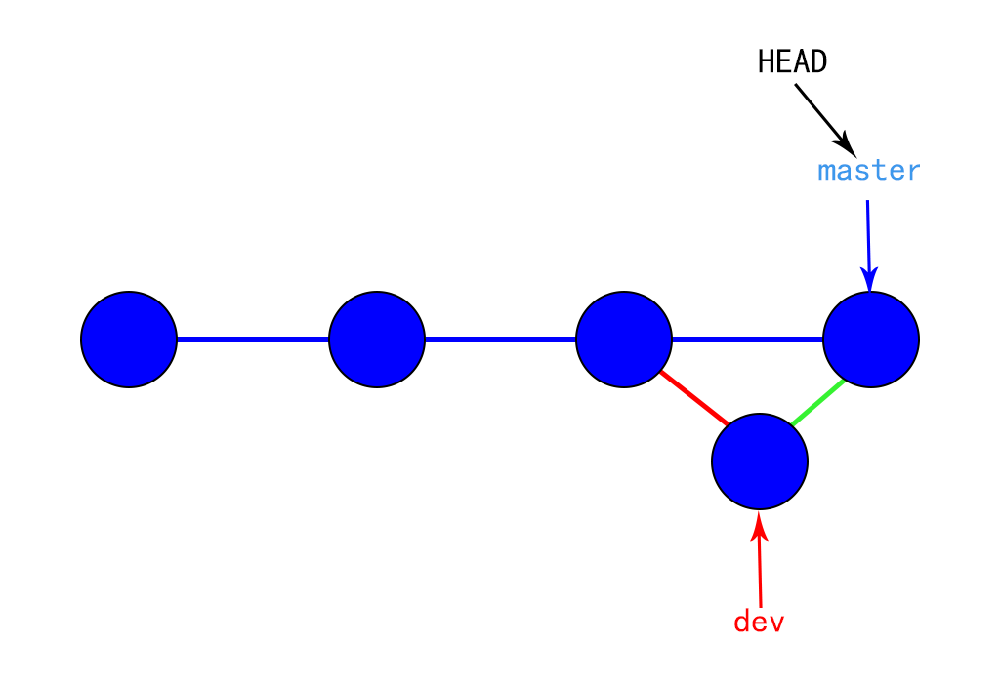

# GIT

## GIT分支管理策略

通常，合并分支时，如果可能，Git会用`Fast forward`模式，但这种模式下，删除分支后，会丢掉分支信息。

如果要强制禁用`Fast forward`模式，Git就会在merge时生成一个新的commit，这样，从分支历史上就可以看出分支信息。

下面我们实战一下`--no-ff`方式的`git merge`：

首先，仍然创建并切换`dev`分支：

```bash
$ git switch -c dev
Switched to a new branch 'dev'
```

修改readme.txt文件，并提交一个新的commit：

```bash
$ git add readme.txt 
$ git commit -m "add merge"
[dev f52c633] add merge
 1 file changed, 1 insertion(+)
```

现在，我们切换回`master`：

```bash
$ git switch master
Switched to branch 'master'
```

准备合并`dev`分支，请注意`--no-ff`参数，表示禁用`Fast forward`：

```
$ git merge --no-ff -m "merge with no-ff" dev
Merge made by the 'recursive' strategy.
 readme.txt | 1 +
 1 file changed, 1 insertion(+)f
```

因为本次合并要创建一个新的commit，所以加上`-m`参数，把commit描述写进去。

合并后，我们用`git log`看看分支历史：

```bash
$ git log --graph --pretty=oneline --abbrev-commit
*   e1e9c68 (HEAD -> master) merge with no-ff
|\  
| * f52c633 (dev) add merge
|/  
*   cf810e4 conflict fixed
...
```

可以看到，不使用`Fast forward`模式，merge后就像这样：



## 分支管理

现在已经创建、合并、删除了一些分支，让我们看看一些常用的分支管理工具。

`git branch` 命令不只是可以创建与删除分支。 如果不加任何参数运行它，会得到当前所有分支的一个列表：

```bash
$ git branch
  iss53
* master
  testing
```

注意 `master` 分支前的 `*` 字符：它代表现在检出的那一个分支（也就是说，当前 `HEAD` 指针所指向的分支）。 这意味着如果在这时候提交，`master` 分支将会随着新的工作向前移动。 如果需要查看每一个分支的最后一次提交，可以运行 `git branch -v` 命令：

```bash
$ git branch -v
  iss53   93b412c fix javascript issue
* master  7a98805 Merge branch 'iss53'
  testing 782fd34 add scott to the author list in the readmes
```

`--merged` 与 `--no-merged` 这两个有用的选项可以过滤这个列表中已经合并或尚未合并到当前分支的分支。 如果要查看哪些分支已经合并到当前分支，可以运行 `git branch --merged`：

```bash
$ git branch --merged
  iss53
* master
```

因为之前已经合并了 `iss53` 分支，所以现在看到它在列表中。 在这个列表中分支名字前没有 `*` 号的分支通常可以使用 `git branch -d` 删除掉；你已经将它们的工作整合到了另一个分支，所以并不会失去任何东西。

查看所有包含未合并工作的分支，可以运行 `git branch --no-merged`：

```bash
$ git branch --no-merged
  testing
```

这里显示了其他分支。 因为它包含了还未合并的工作，尝试使用 `git branch -d` 命令删除它时会失败：

```bash
$ git branch -d testing
error: The branch 'testing' is not fully merged.
If you are sure you want to delete it, run 'git branch -D testing'.
```

如果真的想要删除分支并丢掉那些工作，如同帮助信息里所指出的，可以使用 `-D` 选项强制删除它。

### 分支策略

在实际开发中，我们应该按照几个基本原则进行分支管理：

### 长期分支

因为 Git 使用简单的三方合并，所以就算在一段较长的时间内，反复把一个分支合并入另一个分支，也不是什么难事。 也就是说，在整个项目开发周期的不同阶段，你可以同时拥有多个开放的分支；你可以定期地把某些主题分支合并入其他分支中。

许多使用 Git 的开发者都喜欢使用这种方式来工作，比如只在 `master` 分支上保留完全稳定的代码——有可能仅仅是已经发布或即将发布的代码。 他们还有一些名为 `develop` 或者 `next` 的平行分支，被用来做后续开发或者测试稳定性——这些分支不必保持绝对稳定，但是一旦达到稳定状态，它们就可以被合并入 `master` 分支了。 这样，在确保这些已完成的主题分支（短期分支，比如之前的 `iss53` 分支）能够通过所有测试，并且不会引入更多 bug 之后，就可以合并入主干分支中，等待下一次的发布。

事实上我们刚才讨论的，是随着你的提交而不断右移的指针。 稳定分支的指针总是在提交历史中落后一大截，而前沿分支的指针往往比较靠前。


首先，`master`分支应该是非常稳定的，也就是仅用来发布新版本，平时不能在上面干活；

那在哪干活呢？干活都在`dev`分支上，也就是说，`dev`分支是不稳定的，到某个时候，比如1.0版本发布时，再把`dev`分支合并到`master`上，在`master`分支发布1.0版本；

你和你的小伙伴们每个人都在`dev`分支上干活，每个人都有自己的分支，时不时地往`dev`分支上合并就可以了。

所以，团队合作的分支看起来就像这样：

